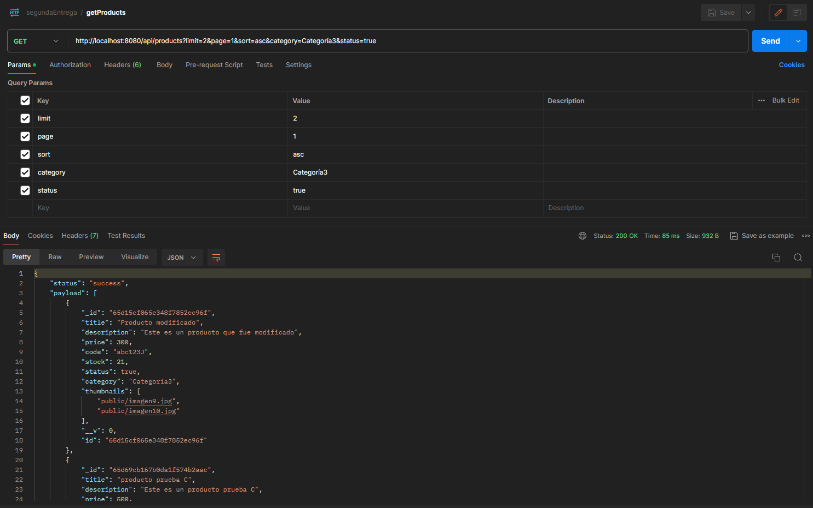
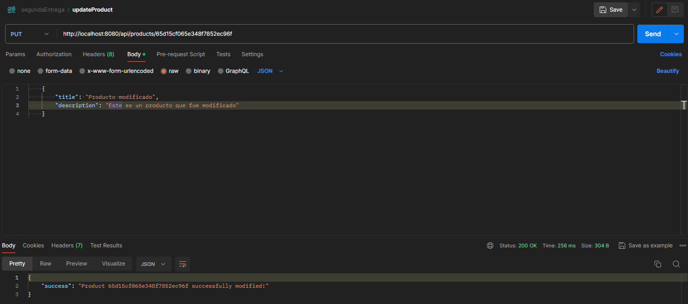
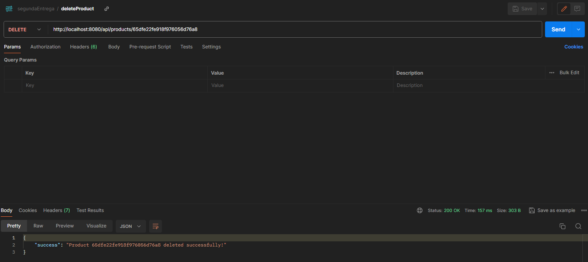
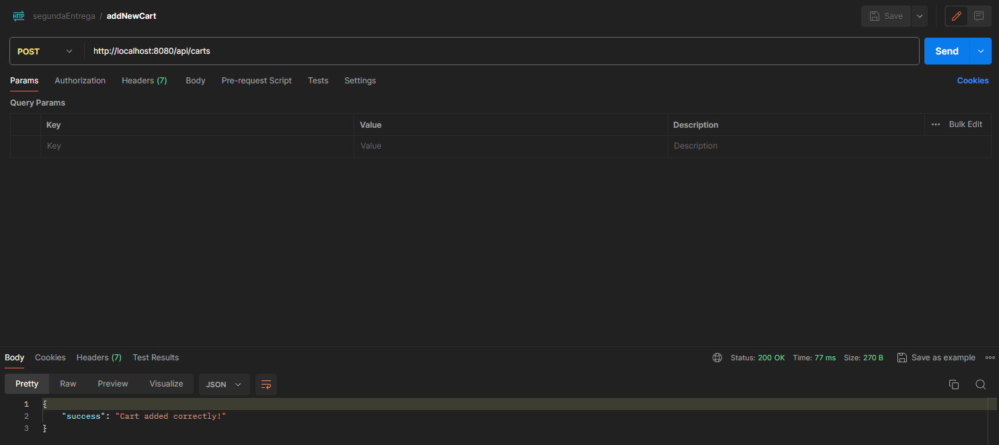
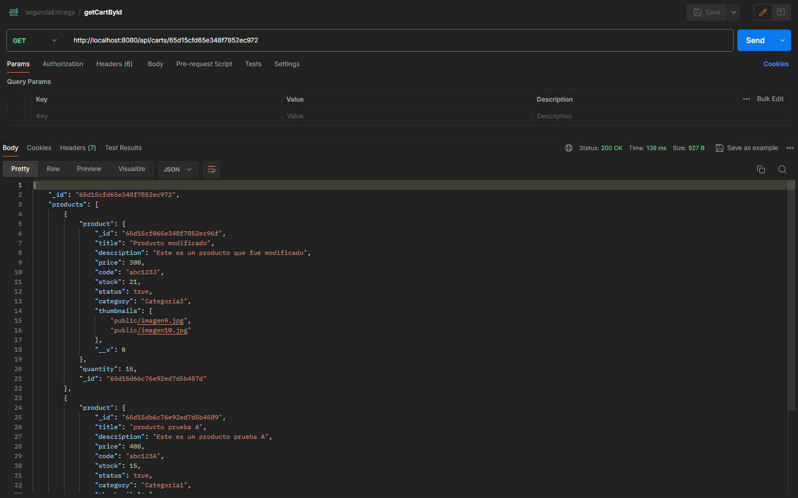
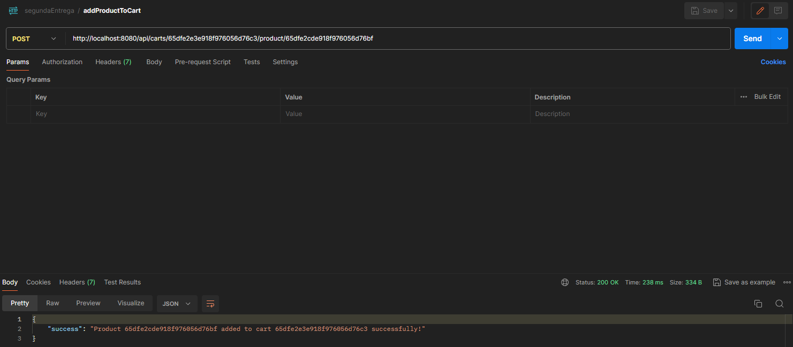
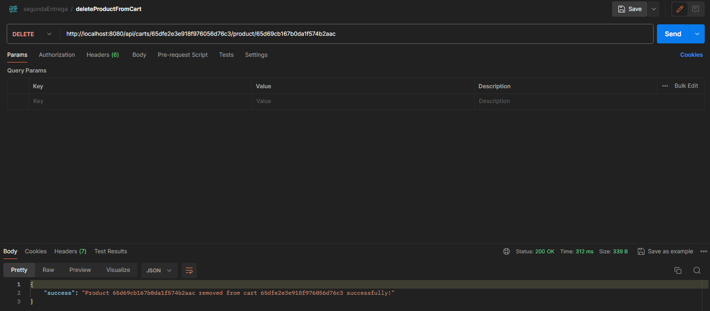
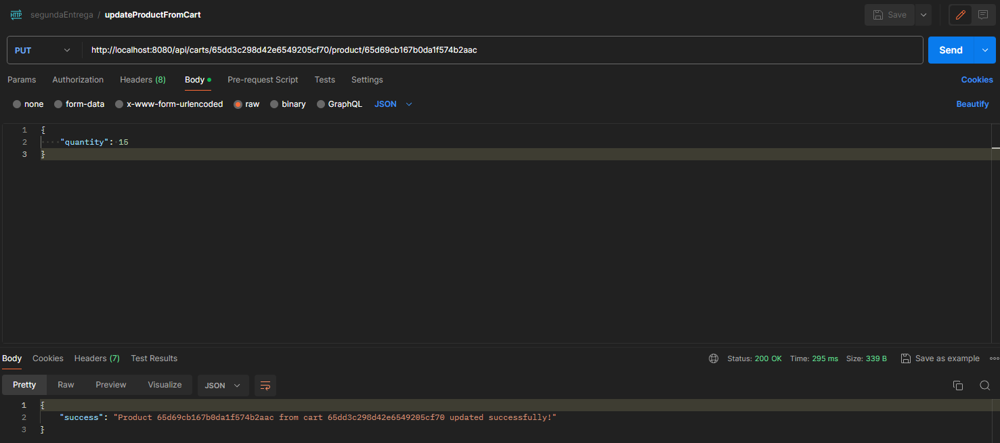
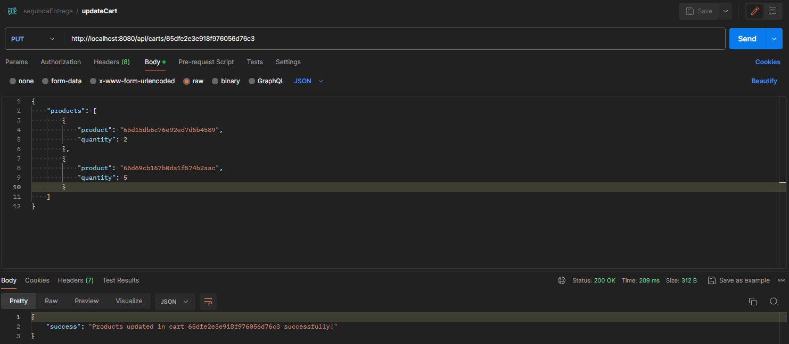

# Proyecto Final Backend. Comisión 50035

## Juan José Boydo

### Capturas de pantalla de los endpoints:

* getProducts. Cuenta con parametros opcionales (limit, sort, page, category, status)

```
GET http://localhost:8080/api/products
```



* getProductsById

```
GET http://localhost:8080/api/products/:pid
```


* addProduct

```
POST http://localhost:8080/api/products
```


* updateProduct

```
PUT http://localhost:8080/api/products/:pid
```



* deleteProduct

```
DELETE http://localhost:8080/api/products/:pid
```



* addNewCart

```
POST http://localhost:8080/api/carts
```



* getCartById

```
GET http://localhost:8080/api/carts/:cid
```



* addProductToCart

```
POST http://localhost:8080/api/carts/:cid/product/:pid
```



* deleteProductFromCart

```
DELETE http://localhost:8080/api/carts/:cid/product/:pid
```



* deleteCart

```
DELETE http://localhost:8080/api/carts/:cid
```


* updateProductFromCart (Se debe enviar por body la cantidad nueva del producto)

```
PUT http://localhost:8080/api/carts/:cid/product/:pid
```



* updateCart (Se debe enviar por body el arreglo nuevo de productos, junto a sus cantidades)

```
PUT http://localhost:8080/api/carts/:cid
```

